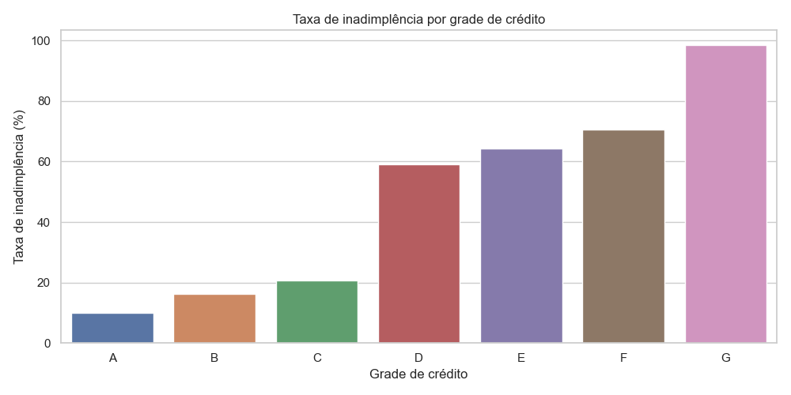
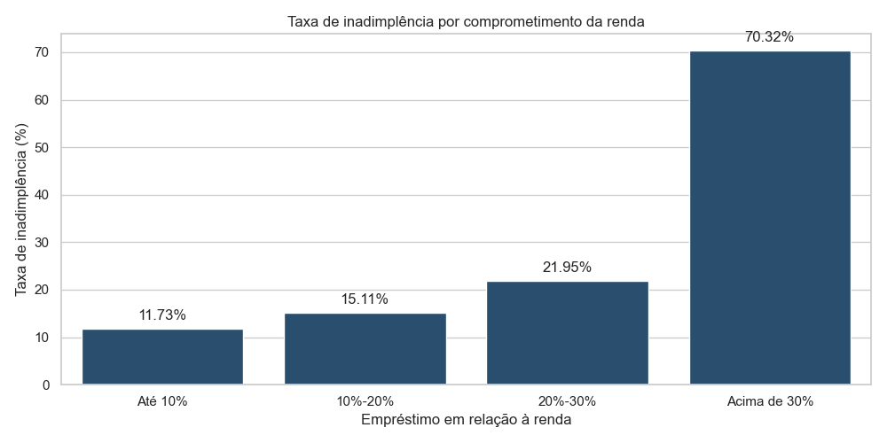

# Análise de risco de crédito com Python

Este projeto é uma análise exploratória de uma base de crédito. A ideia foi entender o perfil dos clientes, padrões de inadimplência e fatores que podem estar relacionados ao risco de crédito.

Usei Python para limpar os dados, criar variáveis, analisar indicadores de risco e gerar visualizações simples para apoiar uma leitura de negócio.

## Objetivo

Analisar uma base de crédito para responder perguntas como:

- Qual é a taxa geral de inadimplência?
- Quais perfis apresentam maior risco?
- A renda influencia a inadimplência?
- O comprometimento da renda com o empréstimo afeta o risco?
- A grade de crédito diferencia bem os grupos de risco?
- Quais finalidades de empréstimo têm maior inadimplência?

## Ferramentas usadas

- Python
- pandas
- numpy
- matplotlib
- seaborn
- Jupyter Notebook
- GitHub

## Etapas do projeto

1. Carregamento da base
2. Entendimento inicial dos dados
3. Tratamento de valores ausentes
4. Criação de variáveis auxiliares
5. Cálculo da taxa geral de inadimplência
6. Análise por grupos
7. Criação de gráficos
8. Registro dos principais achados

## Principais achados

- A taxa geral de inadimplência da base foi de **21,82%**.
- Clientes de baixa renda apresentaram inadimplência maior do que clientes de alta renda.
- O comprometimento da renda com o empréstimo foi um dos sinais mais fortes de risco.
- Clientes com empréstimos acima de 30% da renda tiveram inadimplência muito superior aos demais grupos.
- Grades de crédito piores apresentaram taxas de inadimplência bem mais altas.
- As finalidades `DEBTCONSOLIDATION`, `MEDICAL` e `HOMEIMPROVEMENT` tiveram maiores taxas de inadimplência.

## Alguns resultados

### Inadimplência por finalidade do empréstimo

| Finalidade | Taxa de inadimplência |
|---|---:|
| DEBTCONSOLIDATION | 28,59% |
| MEDICAL | 26,70% |
| HOMEIMPROVEMENT | 26,10% |
| PERSONAL | 19,89% |
| EDUCATION | 17,22% |
| VENTURE | 14,81% |

### Inadimplência por grade de crédito

| Grade | Taxa de inadimplência |
|---|---:|
| A | 9,96% |
| B | 16,28% |
| C | 20,73% |
| D | 59,05% |
| E | 64,42% |
| F | 70,54% |
| G | 98,44% |

### Inadimplência por comprometimento da renda

| Empréstimo sobre renda | Taxa de inadimplência |
|---|---:|
| Até 10% | 11,73% |
| 10%-20% | 15,11% |
| 20%-30% | 21,95% |
| Acima de 30% | 70,32% |

## Exemplos de gráficos

### Taxa de inadimplência por grade de crédito



### Taxa de inadimplência por comprometimento da renda



## Estrutura do projeto

```text
credit-risk-analysis-python/
├── data/
│   ├── raw/
│   └── processed/
├── notebooks/
│   └── 01_credit_risk_analysis.ipynb
├── outputs/
│   ├── charts/
│   └── tables/
├── reports/
│   └── executive_summary.md
├── requirements.txt
└── README.md